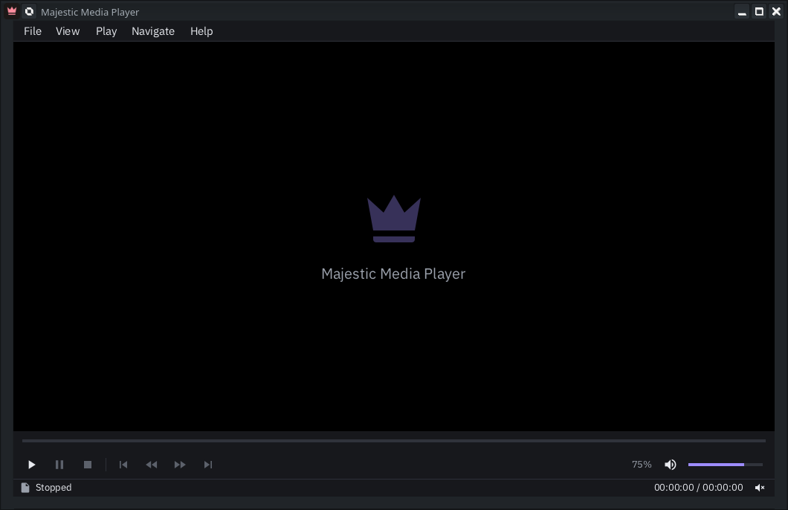

# Majestic Media Player



A dark-themed video player built on [libmpv](https://mpv.io) with a
[Silky](https://github.com/treeform/silky) immediate-mode UI, written in Nim.

## Install

```sh
git clone https://github.com/arkl1te/majestic-media-player.git
cd majestic-media-player
./install.sh
```

That's it. The script installs any missing packages with `pacman` (on
CachyOS / Arch), builds the player and installs it for your user. Open the
application launcher and search for **Majestic Media Player**, or right-click a
video in Dolphin → Open With → Majestic Media Player.

| Command | What it does |
|---|---|
| `./install.sh` | Build and install for the current user (`~/.local`, no root needed) |
| `./install.sh --system` | Build, then install for all users under `/usr/local` (uses `sudo`) |
| `./install.sh --uninstall` | Remove the per-user install (add `--system` for the system-wide one) |

To update, `git pull` and run `./install.sh` again.

What gets installed (`PREFIX` is `~/.local` or `/usr/local`):

- `PREFIX/bin/majestic-media-player`: the player (a single self-contained binary)
- `PREFIX/share/applications/majestic-media-player.desktop`: the launcher entry,
  which also registers the player in "Open With" for common video and audio types
- `PREFIX/share/icons/hicolor/scalable/apps/majestic-media-player.svg`: the icon

The launcher entry points to the binary by its full path, so it starts even if
`~/.local/bin` isn't on your `PATH`. Afterwards the installer refreshes the
desktop and KDE menu caches so the entry shows up without logging out.

Files can also be passed on the command line (`majestic-media-player a.mkv`),
but that's optional. Without them it opens empty and you use File ▸ Open.

### Building manually

```sh
sudo pacman -S --needed nim git base-devel mpv libx11 libxrandr kdialog
make                                   # fetches pinned deps into ./vendor, then compiles
make run                               # run from the source tree
make install                           # per-user install, same as ./install.sh
sudo make install PREFIX=/usr/local    # system-wide (run `make` as yourself first)
make install DESTDIR=pkgdir PREFIX=/usr  # staged install for packaging
```

`make uninstall` (with the same `PREFIX`) removes it again.

In a terminal, `make` shows a progress bar for the current step (each
dependency being cloned, then Nim's module checking, C compilation and
linking) and an overall bar underneath. When the output is piped or logged,
it prints plain status lines instead.

`kdialog` provides the native file dialogs (`zenity` works as a fallback).
Dependencies are pinned in `deps.lock` and cloned by `tools/fetch_deps.sh`, so
builds don't depend on whatever is in `~/.nimble`.

## Notes

- Windy (Silky's windowing layer) is X11-only on Linux, so the player runs
  through XWayland on a Wayland session. Window dragging, always-on-top and
  aspect-locked resizing use EWMH/ICCCM hints, which KWin honours.
- Menus are override-redirect X11 popup windows (no frame, taskbar entry or
  focus, like a toolkit's menus), so they can extend past the main window.
  They are drawn with the main window's GL context and the same Silky atlas.
- vsync is disabled on purpose: with NVIDIA under XWayland, a vsync'd
  `glXSwapBuffers` can block for seconds when the window is hidden. Video frames
  are paced from mpv's frame timing instead; the compositor prevents tearing.
- Settings and recent files live in `~/.config/majestic-media-player/config.json`.
- The UI font is IBM Plex Sans (SIL Open Font License), embedded in the binary.

## Source layout

| File | Purpose |
|---|---|
| `src/majestic.nim` | App state, menus, layout, panels, main loop |
| `src/player.nim` | mpv playback instance, thumbnail-preview instance, folder helpers |
| `src/videogl.nim` | mpv → texture rendering and the transformed video quad |
| `src/menutree.nim` | Menu bar / popup / context-menu system |
| `src/ui.nim` | Widget helpers on top of Silky's drawing primitives |
| `src/xwin.nim` | X11 helpers (drag, on-top, aspect hints, monitors, menu popup windows) |
| `src/config.nim`, `src/dialogs.nim`, `src/theme.nim`, `src/icons.nim` | Settings, file dialogs, palette, vector icons |

## Debugging

- `MMP_DEBUG=1` prints mpv's log to stderr.
- `MMP_SCRIPT` drives the UI for automated checks, e.g.
  `MMP_SCRIPT="1:open ~/v.mkv;3:menu 1;3.5:shot /tmp/view.png;4:quit"`.
  Commands: `open`, `menu <bar> [sub...]`, `ctx x y`, `close`, `mouse x y|off`,
  `overlay <name>`, `action Menu/Sub/Item`, `fs 0|1`, `seek t`, `pause`,
  `size w h`, `set prop value`, `dump props...`, `shot file.png`, `quit`.
  `shot` also writes each open menu popup as `file-menuN.png`.
